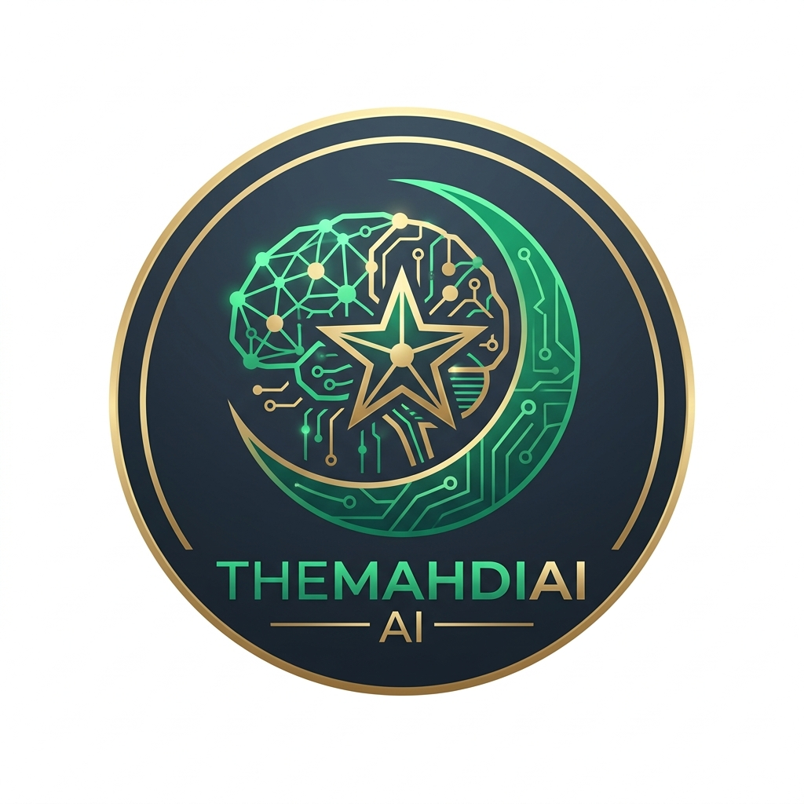

<p align="center">
  
</p>

<h1 align="center">TheMahdiAI</h1>

<p align="center">
  <strong>Advanced The Ahmadi Religion of Peace and Light (AROPL) Knowledge Assistant powered by AI & RAG</strong>
</p>

<p align="center">
  
  
  
  
  
</p>

---

## 🌟 Overview

**TheMahdiAI** is an open-source, production-ready Telegram Bot designed to provide accurate, context-aware Islamic knowledge. It leverages a modern AI stack with RAG (Retrieval-Augmented Generation) and a robust 3-level failover gateway to ensure reliable and high-quality responses.

Built for the community, it integrates Quranic texts, authentic Hadiths, and scholarly references into a seamless, interactive chat experience.

## ✨ Key Features

- **🛡️ 3-Level AI Failover Gateway**: Automatic fallback between OpenAI, Anthropic, and Groq using LiteLLM and Circuit Breakers.
- **⚡ Parallel Processing & Streaming**: Concurrent message handling with progressive response delivery for a low-latency feel.
- **🔒 Smart Quota & Rate Limiting**: Built-in protection with Redis-based limits (minutely/daily) and persistent Database Fallback.
- **📊 Premium Admin Dashboard**: Modern Next.js dashboard to manage users, monitor real-time sessions, and audit detailed chat histories on dedicated pages.
- **📚 RAG-Ready Architecture**: Built-in support for Qdrant Vector DB to ground AI responses in verified knowledge sources.
- **🌐 Global Multi-lingual Support**: Native support for 15+ priority languages with manual custom entry.
- **🛠️ Dynamic Orchestration**: Hot-reload system prompts, token limits, and bot configurations via the dashboard.

## 🚀 Getting Started

### Prerequisites

- Python 3.9+
- PostgreSQL & Redis
- [uv](https://github.com/astral-sh/uv) (Highly recommended for package management)
- Docker & Docker Compose (Optional, for easy infra setup)

### Installation

1. **Clone the repository**:
   ```bash
   git clone https://github.com/TheHashemCode/TheMahdiAI.git
   cd TheMahdiAI
   ```

2. **Setup Environment**:
   ```bash
   cp .env.example .env
   # Edit .env with your API keys and database credentials
   ```

3. **Install Dependencies**:
   ```bash
   pip install uv
   uv pip install -r requirements.txt
   ```

4. **Initialize Database**:
   ```bash
   alembic upgrade head
   ```

5. **Run API (Backend)**:
   ```bash
   python -m uvicorn app.main:app --reload
   ```

6. **Run Dashboard (Frontend)**:
   ```bash
   cd dashboard
   npm run dev
   ```
   *Dashboard will be available at [http://localhost:10313](http://localhost:10313)*

## 🏗️ Technical Stack

- **Framework**: [FastAPI](https://fastapi.tiangolo.com/)
- **ORM**: [SQLModel](https://sqlmodel.tiangolo.com/) (SQLAlchemy + Pydantic)
- **AI Gateway**: [LiteLLM](https://docs.litellm.ai/)
- **Migrations**: [Alembic](https://alembic.sqlalchemy.org/)
- **Vector DB**: [Qdrant](https://qdrant.tech/)

## 📂 Project Structure

- `app/`: Core application logic (Bot handlers, AI Gateway, Models).
- `docs/`: Technical documentation and flowcharts.
- `contexts/`: Knowledge base for AI Agents and development best practices.
- `alembic/`: Database migration scripts.
- `assets/`: Project images and branding.

## 🤝 Contributing

Contributions are welcome! Please feel free to submit a Pull Request. For major changes, please open an issue first to discuss what you would like to change.

1. Fork the Project
2. Create your Feature Branch (`git checkout -b feat/AmazingFeature`)
3. Commit your Changes (`git commit -m 'Add some AmazingFeature'`)
4. Push to the Branch (`git push origin feat/AmazingFeature`)
5. Open a Pull Request

## 📜 License

Distributed under the MIT License. See `LICENSE` for more information.

---
<p align="center">
  <i>Developed by Wau Hashem & The Hashem Code Projects</i>
</p>
