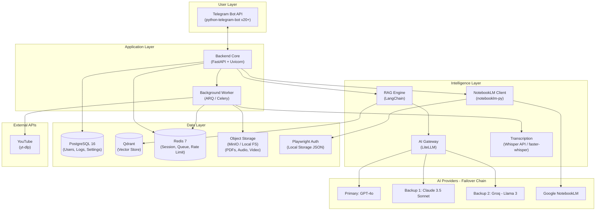
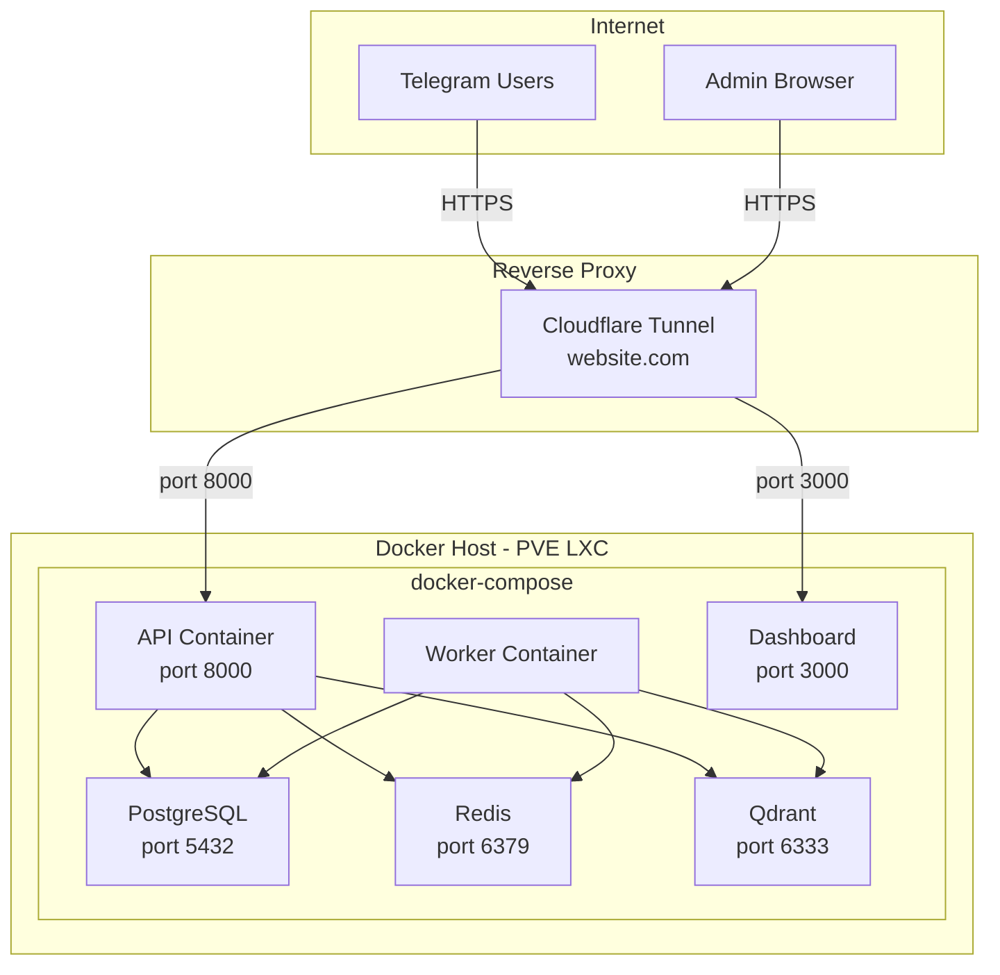

# System Architecture & Infrastructure

## 1. Layer Overview



---

## 2. Project Directory Structure

```
themahdiai/
├── app/
│   ├── main.py                    # FastAPI application factory
│   ├── api/                       # API Endpoints
│   ├── bot/                       # Telegram Bot Handlers
│   ├── core/                      # Global logic (AI Gateway, Rate Limit)
│   ├── services/                  # Business Logic (RAG, YT, Summarizer)
│   ├── models/                    # SQLModel database schemas
│   └── utils/                     # Helpers
├── dashboard/                     # Admin Dashboard (Next.js)
├── docker/                        # Dockerfiles
├── docs/                          # Human-facing documentation
├── contexts/                      # AI-facing context/best practices
└── docker-compose.prod.yml
```

---

## 3. Deployment Topology



---

## 4. Resource Requirements

| Service | CPU | RAM | Storage |
|---------|-----|-----|---------|
| API | 2 vCPU | 1 GB | 500 MB |
| Worker | 2 vCPU | 2 GB | 5 GB (temp) |
| Dashboard | 1 vCPU | 512 MB | 200 MB |
| PostgreSQL | 2 vCPU | 2 GB | 10 GB+ |
| Redis | 1 vCPU | 256 MB | 100 MB |
| Qdrant | 2 vCPU | 2 GB | 5 GB+ |
| **Total** | **10 vCPU** | **8 GB** | **~21 GB** |
