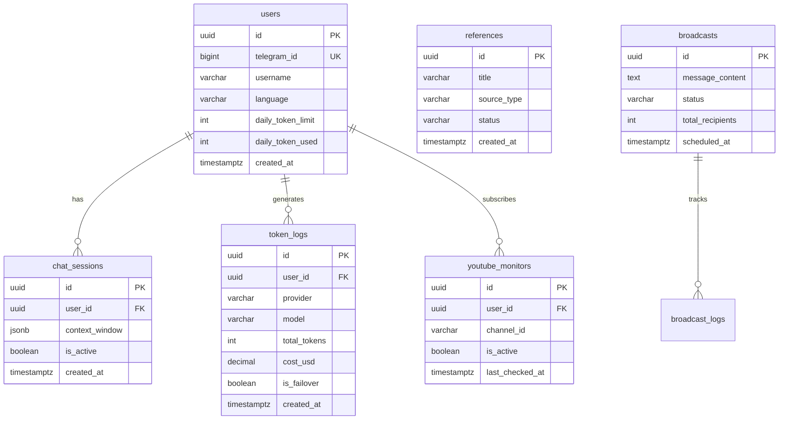

# Database Schema & Data Models

## 1. Entity Relationship Diagram

## 2. Table Indexing

| Table | Index | Purpose |
|-------|-------|---------|
| `users` | `idx_users_telegram_id` | Fast lookup by Telegram ID |
| `chat_sessions` | `idx_sessions_user_active` | Retrieve current user session |
| `token_logs` | `idx_tokenlog_user_date` | Aggregate daily token usage |
| `references` | `idx_ref_status` | Filter by ingestion status |
